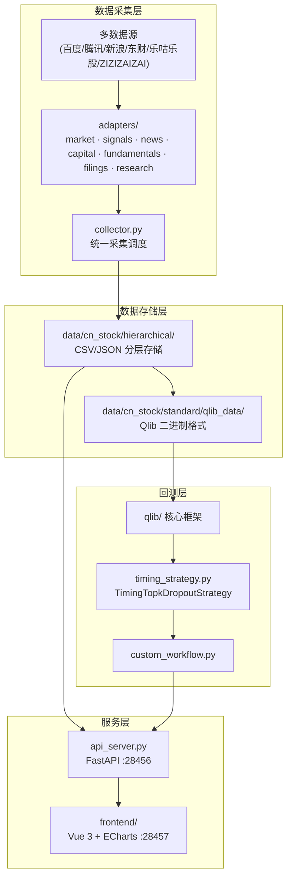

# Architecture Index

本项目在 Microsoft Qlib 框架之上构建了面向 A 股市场的数据采集、可视化和回测系统。

## 整体架构

## 模块说明

### 1. 数据采集层 (`backend/`)

| 组件 | 职责 |
|------|------|
| `collector.py` | 统一采集调度器，管理多源下载、规范化和 Qlib dump |
| `adapters/` | 插件化数据源适配器，每个文件对应一类数据 |
| `stock_resolver.py` | 股票代码/名称智能解析（腾讯 SmartBox API） |
| `update_all_data.py` | 全量数据更新脚本（含定时任务支持） |
| `fetch_zizizaizai_*.py` | ZIZIZAIZAI 平台数据抓取 |
| `backfill_*.py` | 历史数据回填工具 |

### 2. 数据存储层 (`data/cn_stock/`)

- **hierarchical/** — 分层 CSV/JSON，按 `market/signals/news/capital/fundamentals/filings/research` 分类
- **standard/qlib_data/** — Qlib 高性能二进制格式，用于模型训练和回测

### 3. 服务层

- **api_server.py** (FastAPI, :28456) — RESTful API，提供：
  - 股票解析 `/api/resolve_symbol/{query}`
  - 实时数据拉取 `/api/stock/{symbol}/fetch`
  - 回测结果 `/api/backtest/results`
  - YMOS 风控审计 `/api/stock/audit/{symbol}`
  - iWencai NL 搜索 `/api/iwencai/search`
  - 数据刷新 `/api/refresh`

- **frontend/** (Vue 3 + Vite, :28457) — 6 个看板页面：
  - `MarketDashboard.vue` — 市场情绪总览
  - `TopicDashboard.vue` — 热点题材 K 线
  - `StockDashboard.vue` — 个股多维研究
  - `AiReportDashboard.vue` — AI 早报
  - `IwencaiDashboard.vue` — iWencai 搜索
  - `Backtest.vue` — 回测收益曲线

### 4. 回测层

- **custom_workflow.py** — Qlib 回测工作流入口（训练 → 信号生成 → 组合分析）
- **timing_strategy.py** — `TimingTopkDropoutStrategy`，基于市场情绪动态调整仓位
- **qlib/** — 上游 Qlib 核心框架（数据引擎、模型、策略、执行器）
