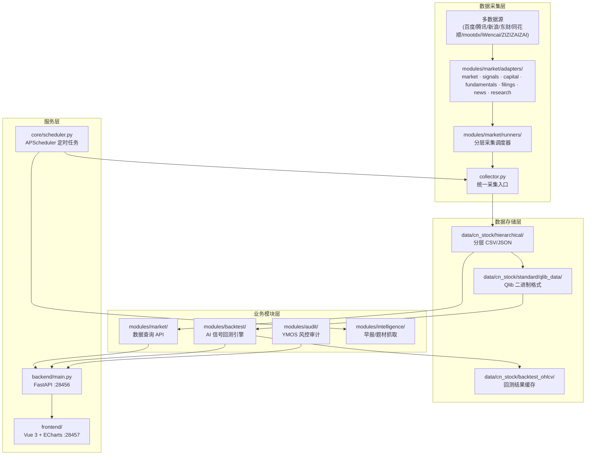

# Architecture Index

本项目在 Microsoft Qlib 框架之上构建了面向 A 股市场的数据采集、可视化和回测系统。

## 整体架构

## 模块说明

### 1. 核心基础设施层 (`backend/core/`)

| 文件 | 职责 |
|------|------|
| [config.py](file:///Users/walox/qlib/backend/core/config.py) | 全局配置：路径常量、`secret.yaml` 加载、共享实例 (`resolver`, `iwencai_adapter`) |
| [scheduler.py](file:///Users/walox/qlib/backend/core/scheduler.py) | APScheduler 定时任务：09:00 盘前抓早报、16:00 盘后下载数据+回测 |
| [data_resolver.py](file:///Users/walox/qlib/backend/core/data_resolver.py) | 数据采集编排器：动态自选股聚合（龙虎榜/涨停/北向/炸板）、单股多层数据获取与缓存 |
| [trading_calendar.py](file:///Users/walox/qlib/backend/core/trading_calendar.py) | 交易日历判断 |
| [data_schema.py](file:///Users/walox/qlib/backend/core/data_schema.py) | 数据 schema 校验（市场情绪、K线字段） |

### 2. 数据采集层 (`backend/modules/market/`)

采用**插件化适配器 + 分层 Runner** 架构：

| 组件 | 职责 |
|------|------|
| [adapters/base.py](file:///Users/walox/qlib/backend/modules/market/adapters/base.py) | 抽象基类 `BaseSourceAdapter` + 工具函数（代码格式转换）+ 弹性 HTTP（熔断器 + 指数退避重试） |
| [adapters/](file:///Users/walox/qlib/backend/modules/market/adapters) | 各类数据源适配器，每个文件对应一类数据源 |
| [runners/](file:///Users/walox/qlib/backend/modules/market/runners) | 分层采集调度器，每个 Runner 负责一个数据层 |
| [collector.py](file:///Users/walox/qlib/backend/modules/market/collector.py) | 统一采集入口 `CnStockCollector`，支持多源切换 (akshare/mootdx 等) |
| [service.py](file:///Users/walox/qlib/backend/modules/market/service.py) | 实时行情服务（分钟线/日线数据获取） |
| [router.py](file:///Users/walox/qlib/backend/modules/market/router.py) | 数据查询 API 路由 |

**适配器清单**（继承 `BaseSourceAdapter`，通过 `adapters/__init__.py` 统一导出）：

| 类别 | 文件 | 数据源 |
|------|------|--------|
| market | `market.py` | Mootdx, Akshare, Tencent/Sina, Baidu Kline, Eastmoney |
| signals | `signals/*.py` | THS 热度/北向、百度概念、东财资金流/龙虎榜/解禁/行业、市场情绪 |
| capital | `capital.py` | 融资融券、大宗交易、股东、分红、个股资金流 |
| fundamentals | `fundamentals.py` | Mootdx 财务/F10、东财个股信息、新浪财报 |
| filings | `filings.py` | 巨潮公告 |
| news | `news.py` | 东财个股新闻、财联社电报、东财全球新闻 |
| research | `research.py` | 东财研报、THS 一致预期、iWencai NL 搜索 |
| legacy | `legacy.py` | Zizizaizai, Zzshare（旧版适配器） |
| popularity | `popularity.py` | 东财人气、同花顺人气 |

### 3. AI 信号回测引擎 (`backend/modules/backtest/`)

| 文件 | 职责 |
|------|------|
| [signal_backtest.py](file:///Users/walox/qlib/backend/modules/backtest/signal_backtest.py) | 回测核心引擎：入场(首次入选)、出场(落选)、权重(core 2x / new 1.5x)、ML 过滤、大盘择时(20日均线) |
| [service.py](file:///Users/walox/qlib/backend/modules/backtest/service.py) | 回测服务层：缓存管理、数据下载、排行榜、个股回测、legacy Qlib 回测 |
| [scoring.py](file:///Users/walox/qlib/backend/modules/backtest/scoring.py) | 今日推荐评分引擎：ML 预测 + 人气 boost + 风控 veto 混合评分 |
| [live_quotes.py](file:///Users/walox/qlib/backend/modules/backtest/live_quotes.py) | 实时报价：腾讯财经实时行情查询 |
| [router.py](file:///Users/walox/qlib/backend/modules/backtest/router.py) | 回测 API 路由 |
| [data_downloader.py](file:///Users/walox/qlib/backend/modules/backtest/data_downloader.py) | OHLCV 数据下载与加载 |
| [pool_generator.py](file:///Users/walox/qlib/backend/modules/backtest/pool_generator.py) | 题材股票池生成 + 策展池覆盖（`apply_curated_overrides`） |
| [topic_workflow.py](file:///Users/walox/qlib/backend/modules/backtest/topic_workflow.py) | Qlib 工作流（legacy） |

### 4. 风控审计 (`backend/modules/audit/`)

| 文件 | 职责 |
|------|------|
| [service.py](file:///Users/walox/qlib/backend/modules/audit/service.py) | 聚合新闻/公告/研报/互动易/iWencai 数据 → DeepSeek 生成 YMOS 风控报告 |
| [router.py](file:///Users/walox/qlib/backend/modules/audit/router.py) | 审计 API 路由 |

### 5. 情报抓取 (`backend/modules/intelligence/`)

| 文件 | 职责 |
|------|------|
| [zizizaizai/reports.py](file:///Users/walox/qlib/backend/modules/intelligence/zizizaizai/reports.py) | Zizizaizai AI 早报抓取 |
| [zizizaizai/topics.py](file:///Users/walox/qlib/backend/modules/intelligence/zizizaizai/topics.py) | 热点题材与个股关联抓取 |
| [zizizaizai/klines.py](file:///Users/walox/qlib/backend/modules/intelligence/zizizaizai/klines.py) | 题材 K 线数据 |
| [sentiment/](file:///Users/walox/qlib/backend/modules/intelligence/sentiment) | 市场情绪补充数据 |
| [router.py](file:///Users/walox/qlib/backend/modules/intelligence/router.py) | 数据刷新 API 路由（全量/早报/题材） |

### 6. 数据存储层 (`data/cn_stock/`)

- **hierarchical/** — 分层 CSV/JSON，按类别分类：
  - `market/` — 日线/分钟线、实时报价
  - `signals/` — 市场情绪、龙虎榜、解禁、百度概念、THS 热度、题材
  - `news/` — 个股新闻、财联社电报
  - `capital/` — 资金流、融资融券、大宗交易
  - `fundamentals/` — 财务数据、F10
  - `filings/` — 公告
  - `research/` — 研报
- **standard/qlib_data/** — Qlib 高性能二进制格式，用于模型训练和回测
- **backtest_ohlcv/** — 信号回测结果缓存（按 model_version + top_k 命名）
- **stock_pools/** — 人工策展股票池（可覆盖 AI 早报池）
- **predictions/** — ML 模型预测结果 (`.pkl`)

### 7. 服务层

**后端 API** (`backend/main.py`, FastAPI, :28456) — 通过 5 个 Router 组织：

| Router | 路由前缀 | 核心端点 |
|--------|---------|---------|
| market | `/api` | `/resolve_symbol/{query}` 股票解析、`/stock/{symbol}/fetch` 数据拉取、`/stock/{symbol}/daily` 日线、`/iwencai/search` NL 搜索、`/data/{layer}/{filename}` 静态数据 |
| backtest | `/api/backtest` | `/results` 回测结果、`/intelligent` 运行回测、`/leaderboard` 排行榜、`/todays-picks` 今日推荐、`/single` 个股回测、`/download-data` 数据下载 |
| audit | `/api/stock` | `/audit/{symbol}` YMOS 风控审计 |
| intelligence | `/api` | `/refresh` 全量刷新、`/refresh/reports` 早报刷新、`/refresh/topics` 题材刷新 + 对应 `/status` 轮询 |
| user | `/api/user` | `/starred_stocks` 自选股增删查 |

**调度器** (`core/scheduler.py`, APScheduler)：
- 09:00 — 盘前抓取 AI 早报
- 16:00 — 盘后下载 OHLCV + 运行信号回测更新缓存

**前端** (`frontend/`, Vue 3 + Vite, :28457) — 6 个看板页面：

| 路由 | 文件 | 功能 |
|------|------|------|
| `/market` | `MarketDashboard.vue` | 市场情绪总览 |
| `/topics` | `TopicDashboard.vue` | 热点题材 K 线 |
| `/stock/:symbol?` | `StockDashboard.vue` | 个股多维研究（含子标签页） |
| `/reports` | `AiReportDashboard.vue` | AI 早报 |
| `/wencai` | `IwencaiDashboard.vue` | iWencai NL 搜索 |
| `/backtest` | `Backtest.vue` | 回测收益曲线 + 排行榜 |

前端通过 Vite proxy 将 `/api` 转发到后端 :28456，数据加载逻辑集中在 [composables/useDataLoader.js](file:///Users/walox/qlib/frontend/src/composables/useDataLoader.js)。
