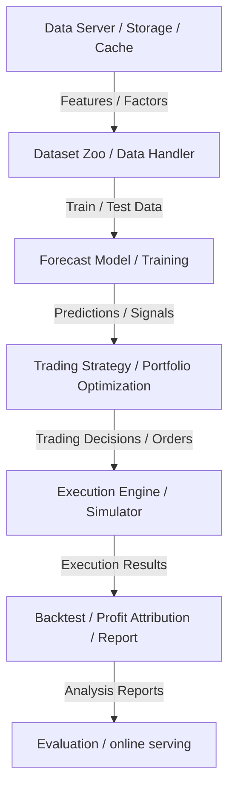

# Architecture Index

Microsoft Qlib is built with a decoupled, layered architecture where components can be used stand-alone or nested within the end-to-end ML pipeline.

## Layers & Components

### 1. Data Layer (`qlib/data`)
- **Storage**: Highly optimized binary format.
- **Expression Engine**: `ops.py` and `_libs` compute technical indicators (factors) on the fly.
- **Caching**: `cache.py` provides expression caching and dataset caching to accelerate repetitive queries.
- **Dataset Zoo**: Handlers in `qlib/contrib/data/handler.py` define standard inputs like `Alpha158` and `Alpha360`.

### 2. Modeling Layer (`qlib/model`, `qlib/contrib/model`)
- **Forecast Model**: Concrete models output predictions (e.g. daily return forecast for each instrument).
- **Trainer**: Manages model training, rolling retrain, and meta-learning models to combat concept drift/market dynamics.

### 3. Execution & Strategy Layer (`qlib/strategy`, `qlib/backtest`)
- **Strategy**: Translates predictions into portfolio positions (e.g., top-K stocks).
- **Executor**: Simulates realistic execution (e.g., daily bar execution, minute bar execution, TWAP, or high-frequency order book matching).
- **Exchange**: Simulates market constraints (liquidity, price limit, trading fees, transaction cost).

### 4. Workflow Layer (`qlib/workflow`)
- **Experiment Manager**: Tracks training parameters, model checkpoints, forecasting signals, and backtest logs (integrates with local files, MLflow, etc.).
- **Task Manager**: Orchestrates rolling retrain schedules, parameter tuning, and parallel experiments.

### 5. Reinforcement Learning Layer (`qlib/rl`)
- **RL Environment**: Wraps trading execution as OpenAI Gym-compatible environments.
- **Nested Decisions**: Optimizes portfolio execution (e.g., high-frequency execution policy nested under daily portfolio planning).
